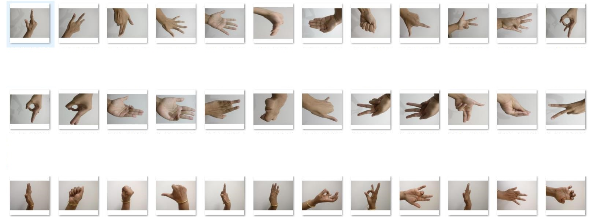
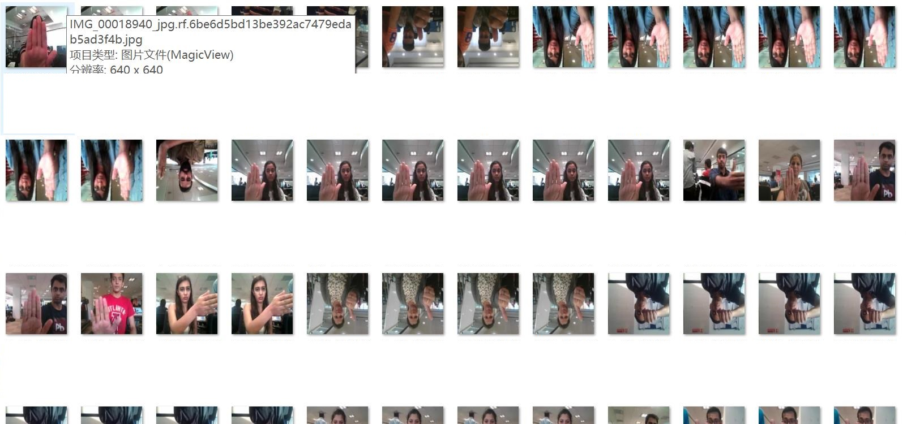
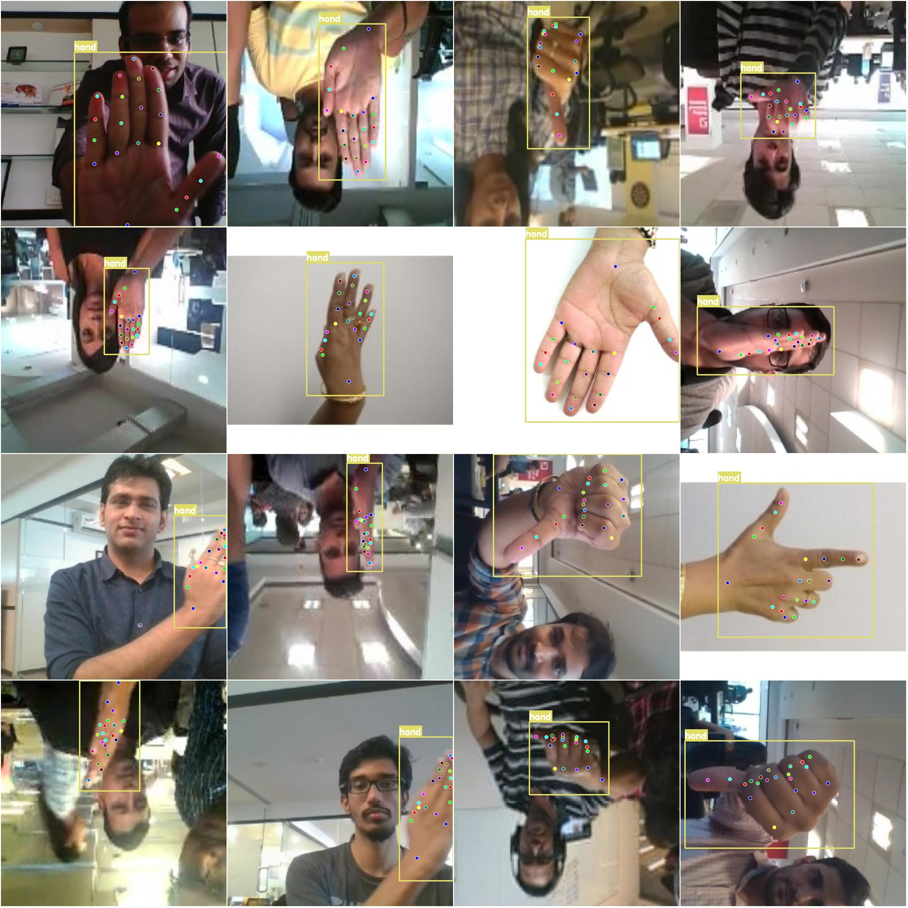

# Hand Pose Estimation Keypoints Dataset COCO+YOLO Format with 2503 Images in 1 Classification

Please note that the dataset contains a large number of enhanced images, primarily rotation enhancements, and some are formed by video densely sampling frames to appear repetitive.

Dataset format: YOLO keypoint format (Note: this is not the target detection or segmentation YOLO format, but simply includes jpg images along with corresponding yolo format txt files).

Number of images (number of jpg files): 2503
Number of labeled images (number of txt files): 2503
Number of training images: 2502
Number of validation images: 1
Number of test images: 0
Number of classification categories: 1
Classification category name: ['hand']
Number of keypoints: 21

Keypoints: ["WRIST", "THUMB_CMC", "THUMB_MCP", "THUMB_IP", "THUMB_TIP", "INDEX_FINGER_MCP", "INDEX_FINGER_PIP", "INDEX_FINGER_DIP", "INDEX_FINGER_TIP", "MIDDLE_FINGER_MCP", "MIDDLE_FINGER_PIP", 
"MIDDLE_FINGER_DIP", "MIDDLE_FINGER_TIP", "RING_FINGER_MCP", "RING_FINGER_PIP", "RING_FINGER_DIP", "RING_FINGER_TIP", "PINKY_MCP", "PINKY_PIP", "PINKY_DIP", "PINKY_TIP"]

Each classification category labels:
Hand keypoints count = 2505
Total keypoints count = 2505
Image resolution: 640x640

Important Note: The dataset has been pre-split into training, validation, and test sets, which can be directly used for training models like YOLOv5-pose, YOLOv8-pose, YOLOv11-pose, or YOLOv26-pose.

Special Notice: This dataset does not guarantee the accuracy of the trained model or the weight files.

Image Preview:

Example of labeled images:

Labeled results:

## Images

Here is a pay link on Stripe ( https://buy.stripe.com/3cs8yP7sY87d0vu9AB ). Please contact me lonlonago@foxmail.com after funding $89, and I will send you a complete data files , thank you!

